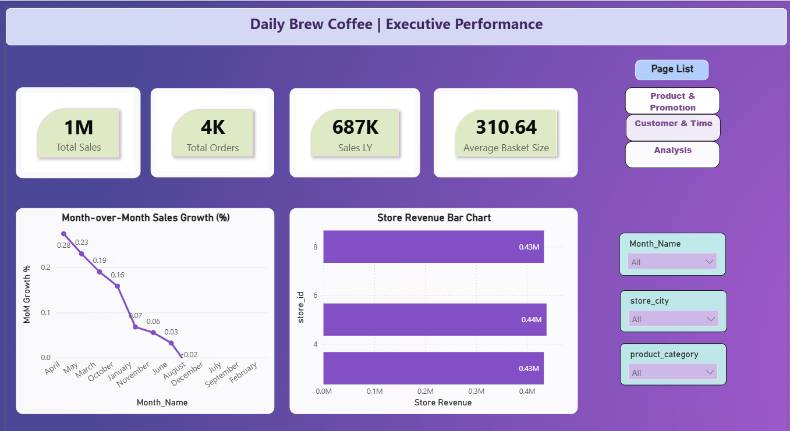

Daily Brew Coffee – Power BI Dashboard
Designed and developed a 4‑page interactive Power BI dashboard for Daily Brew Coffee Ltd., transforming raw sales, customer, product, and staff data into actionable insights. The dashboard highlights:
• 	Executive KPIs: revenue growth, store performance, basket size
• 	Product & Promotion Analysis: top sellers, promo impact, margin trends
• 	Customer & Loyalty Insights: lifetime value, repeat behavior, segmentation
• 	Time & Staff Performance: peak sales hours, employee contribution
Delivered a final Insights & Recommendations page summarizing trends, anomalies, and strategic actions to improve sales, optimize promotions, and strengthen customer retention.
 (Daily Brew Coffee snap2.png) (Daily Brew Coffee snap3.png) (Daily Brew Coffee snap4.png)

